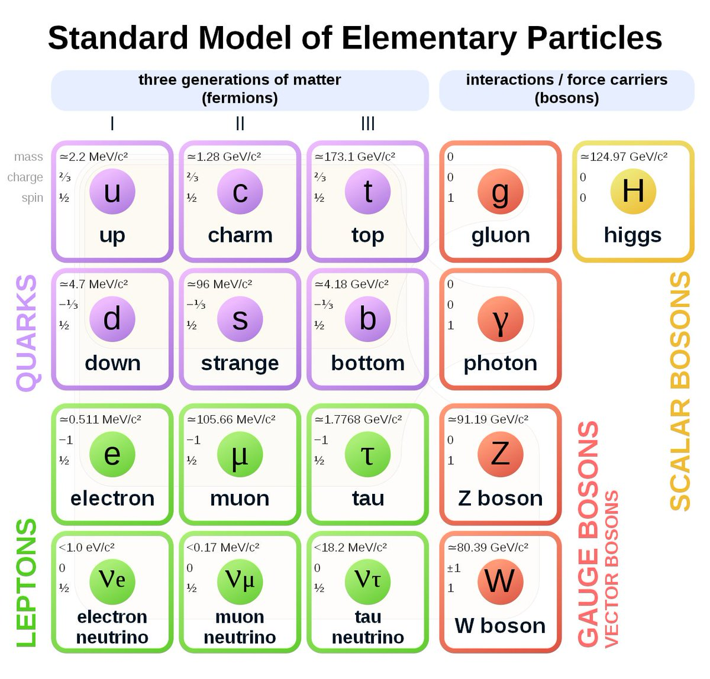
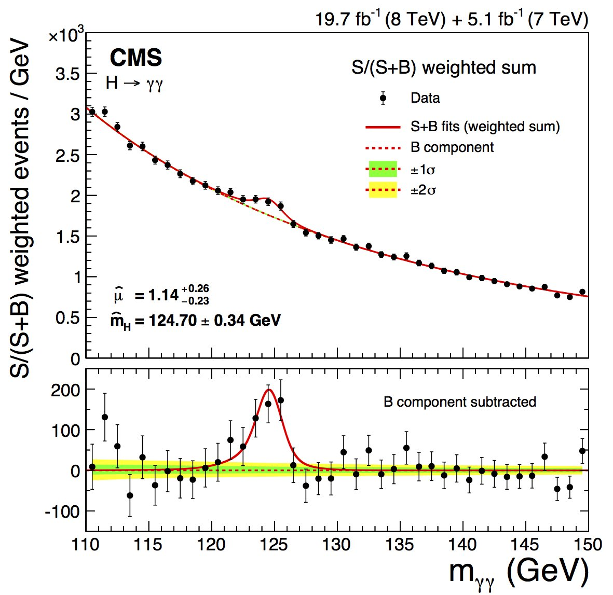

The Belle experiment is an experiment that focuses on B physics. Specifically speaking, the experiment generates large amount of B mesons—kinds of particles that consist of a b-quark and an anti-quark and their anti-particles—which can help us study physics of "flavor."

Before one understands flavor, one has to know about the Standard Model, a theory used to explain experiment results in Particle Physics.

In this conceptual frameworks, neutrons and protons, the particles made up of everyday materials, are made up of up quarks and down quarks, which have two set of heavier copies, strange quark and charm quark and bottom quark and top quark.
The electron also has two heavier copies, muon and tauon, to which three kinds of neutrinos are related.

Between all these particles, there are interactions mediated by certain particles—photon, Z boson and W boson for electroweak interaction, gluon for strong interaction.

Among all mediators, only the W boson can change a particle's flavor e.g. turning a down quark into an up quark, causing a neutron decays into a proton (with an electron and an anti-electron neutrino emitted).

A remark is that, up-type quarks (u, d and s) can only decay into down-type quarks, and vice verse, since the W boson has either +1 or -1 electric charge.

But why did people start the experiment if the theory was so detailed? It’s because physicists were interested in Charge-Parity Violation, a term for physical processes that doesn’t stay the same when the matter is replaced with its anti-matter.

An example is the decay processes B⁰→K⁺π⁻ and B̄⁰→K⁻π⁺. If there were no CPV, they should occur equally often, which was shown not to be the case (with a significance of 3.9σ) by [Belle in 2004](https://arxiv.org/abs/hep-ex/0408100).

So how comes physicists “observe” a particle when it’s subatomic?

As we know charged particles curve in a magnetic field, the curvature—given the magnetic field, B⃗, known—can be translated to the momentum of the particle, p⃗. 

Once we know the momentum of the particle, if we also know the type of the particle (through certain signs in the detectors), we can then assign the mass of the particle, m, and get the energy of the particle. (Energy is composed of the rest mass energy and kinematic one!) 

Mathematically speaking, the relation is E² = m²+|p⃗|².

Why is there no c? Because it’s 1 for us ; ) 

By knowing the energy and the momentum of a particle, you know the 4-momentum of it, (E, p⃗).

A 4-momentum is a better way to describe a particle because an initial-state particle’s 4-momentum equals to the sum of the 4-momenta of the final-state particles. 

That means, if we add up the 4-momenta of certain pairs of particles, and if they do come from a particle’s decay process, we’re going to see a “bump” in the magnitude of the summed 4-momentum.

Now you may be thinking “how do you measure a photon, which has no charge and thus will not curve?”

A photon results in a “spark” that will be seen by a kind of detector called a “calorimeter”. The energy of the photon, E𝛾, can then be determined by how shiny the spark is.

And because the photon doesn’t curve, the direction of the photon can be approximated to the direction of the spark, r̂.

Also, since the photon is massless, E = |p⃗| and so the 4-momentum of the photon can be assigned as (E, Er̂).

Again, once you know how to assign the 4-momentum of a particle, you can use it to hunt for any particle that will decay into it, e.g., the famous Higgs boson seen as two energetic photons.

---

This post is based on a [tweetstorm](https://twitter.com/yuanruleonlin/status/1431132638467686400?s=61&t=U5q2G8Hh3TZd5CIIOX38RQ) that I wrote to get my thesis writing started.
