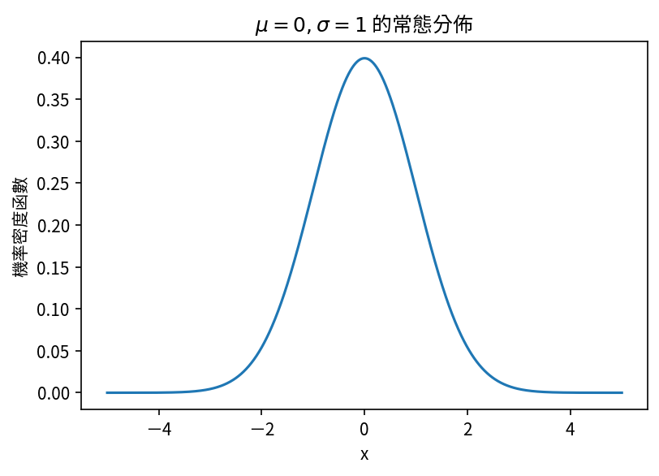

在 `matplotlib` 的圖中顯示中文應該是每個使用 Python 做科學繪圖的人滿想輕鬆解決的問題。

<!--more-->

今天就迅速解決吧。

## 步驟

1. 首先下載 Google 的開源字體 [**Noto Sans CJK TC**](https://www.google.com/get/noto/#sans-hant)。（搜尋 "Taiwan" 能更快找到哦。）
1. 打開資料夾後安裝至少一個字體。（像我是安裝 `NotoSansCJKtc-Regular.otf`。）
1. 刪除 `matplotlib` 的快取資料夾: `rm -rf ~/.matplotlib`
1. 引入 `matplotlib` 並設定字體的參數：

```Python
import matplotlib as mpl
mpl.rcParams.update({"font.sans-serif": "Noto Sans CJK TC"})

# ...
```

這樣就搞定囉。

## 範例

```Python
import numpy as np
import scipy.stats as st
import matplotlib.pyplot as plt
import matplotlib as mpl
mpl.rcParams.update({
    'font.sans-serif': 'Noto Sans CJK TC',
    'figure.dpi': 150, # for prettier plot
    'figure.facecolor': 'white'
})

x = np.linspace(-5, 5, 1001)
gaus = st.norm.pdf(x)

plt.plot(x, gaus)
plt.xlabel("x")
plt.ylabel("機率密度函數")
plt.title(r"$\mu=0, \sigma=1$ 的常態分佈")
plt.show()
```



連跟 LaTeX 都相處融洽呢。

## 關於字體

如果你畫的圖是要商業使用的，最好用[其他字體](https://www.websiteplanet.com/blog/best-free-fonts/)。[^commercial]

[^commercial]: 感謝 Victoria Mesbere 的來信告知。

## References

1. [matplotlib 畫圖時採用 ttc 中文字型](https://newtoypia.blogspot.com/2018/08/matplotlib-ttc.html)
2. [解決Python 3 Matplotlib與Seaborn視覺化套件中文顯示問題](https://medium.com/marketingdatascience/解決python-3-matplotlib與seaborn視覺化套件中文顯示問題-f7b3773a889b)
