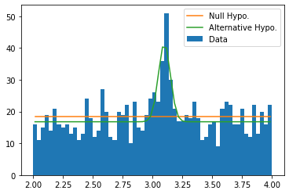

## Prepare pseudo-data


```python
data = np.concatenate((
    st.norm(loc=3.1, scale=0.05).rvs(size=100),
    st.uniform(loc=2., scale=2.).rvs(size=1000)
))
```


```python
plt.hist(data, bins=np.linspace(2., 4., 61))
```


    (array([16., 11., 15., 19., 14., 21., 16., 15., 16., 13., 15., 11., 13.,
            24., 18., 12., 14., 27., 20., 12., 11., 20., 19., 22., 10., 23.,
            15., 14., 19., 24., 26., 23., 36., 51., 30., 21., 17., 17., 19.,
            18., 23., 18., 11., 12., 16., 17.,  9., 21., 23., 22., 16., 16.,
            21., 13., 12., 22., 13., 20., 16., 22.]),
     array([2.        , 2.03333333, 2.06666667, 2.1       , 2.13333333,
            2.16666667, 2.2       , 2.23333333, 2.26666667, 2.3       ,
            2.33333333, 2.36666667, 2.4       , 2.43333333, 2.46666667,
            2.5       , 2.53333333, 2.56666667, 2.6       , 2.63333333,
            2.66666667, 2.7       , 2.73333333, 2.76666667, 2.8       ,
            2.83333333, 2.86666667, 2.9       , 2.93333333, 2.96666667,
            3.        , 3.03333333, 3.06666667, 3.1       , 3.13333333,
            3.16666667, 3.2       , 3.23333333, 3.26666667, 3.3       ,
            3.33333333, 3.36666667, 3.4       , 3.43333333, 3.46666667,
            3.5       , 3.53333333, 3.56666667, 3.6       , 3.63333333,
            3.66666667, 3.7       , 3.73333333, 3.76666667, 3.8       ,
            3.83333333, 3.86666667, 3.9       , 3.93333333, 3.96666667,
            4.        ]),
     <BarContainer object of 60 artists>)


    

    


## Define Hypotheses and Minimize Extended Log-Likelihoods


```python
def null_hypo(nb, x):
    return nb * st.uniform(loc=2., scale=2.).pdf(x)

def alter_hypo(ns, nb, M, x):
    return ns * st.norm(loc=M, scale=0.05).pdf(x) + nb * st.uniform(loc=2., scale=2.).pdf(x)
```


```python
def n2ll_null_hypo(nb):
    '''Returns the extended likelihood of the null hypothesis
    '''
    return 2. * ((nb) - np.sum(np.log(null_hypo(nb, data))))
```


```python
# Sometimes the minimization may not success. You may switch the method
# of minimization to other strategies, which are available in the help
# information of `opt.minimize'.
res_null_hypo = opt.minimize(n2ll_null_hypo, x0=1100, method='Nelder-Mead')
```


```python
def n2ll_alter_hypo(theta):
    '''Returns the extended likelihood of the alternative hypothesis
    '''
    ns, nb, M = theta
    return 2. * ((ns + nb) - np.sum(np.log(alter_hypo(ns, nb, M, data))))
```


```python
res_alter_hypo = opt.minimize(n2ll_alter_hypo, x0=[100, 1000, 3.1], method='Nelder-Mead')
```

### Demostrate Results


```python
bins = np.linspace(2., 4., 61)
dx = bins[1:] - bins[:-1]
xc = (bins[1:] + bins[:-1]) / 2

plt.hist(data, bins=bins, label='Data')
plt.plot(xc, null_hypo(res_null_hypo.x, xc) * dx, label='Null Hypo.')
plt.plot(xc, alter_hypo(*res_alter_hypo.x, xc) * dx, label='Alternative Hypo.')
plt.legend()
```


    <matplotlib.legend.Legend at 0x7fef09185bb0>


    

    


## Calculate $P$\-value and Significance Level

To calculate $P$\-value, one has to figure out what test statisitic to use and what its null hypothesis is (not the null hypothesis of the data we see above, but the null hypothesis of the test statistic).

In this example, we turn to Wilks' Theorem, which states that the test statistic $2 \ln \frac{\max L_{\text{alter}}}{\max L_{\text{null}}}$ has its null hypothesis as $\chi^2_k$ distribution where $k$ is the difference in the dimensions of the two hypotheses.

So what is $k$ in our example? Note that our hypotheses are of the forms

$$\begin{aligned}
L_{\text{null}} &= a,\\
L_{\text{alter}} &= a + b \cdot G(M, \sigma = 0.05).
\end{aligned}$$

It's easy to spot that $k=2$.


```python
chi2 = 2. * (res_null_hypo.fun - res_alter_hypo.fun)
```


```python
p_value = st.chi2(df=2).sf(chi2)
```


```python
significance_level = st.norm.isf(p_value)
```


```python
significance_level
```


    11.047059808997453


